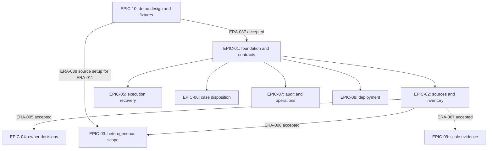

# Development plan

Erasure will be an internal business-account cleanup system for one operating company. Its customer accounts share one control plane and are the tenants whose data is separated. Employees record externally received cleanup requests, source owners approve operations, and adapters execute them. The first release demonstrates that complete workflow and a small deployable version of the architecture used at larger scale.

The plan uses ten epics containing 42 implementation issues. An epic describes a cohesive application capability and groups the coupled issues needed to deliver it. Each epic ends in an observable employee workflow. Backend, frontend, adapters, persistence, authorization, audit, and tests are added together as each behavior needs them. The issues are published on GitHub with native parent/dependency links; planning/github-map.json records their actual numbers and dedicated branches.

## Architecture decision

Use a modular Spring Boot control plane, React/TypeScript frontend, PostgreSQL, OpenID Connect employee login, and independently running Java adapters beside three synthetic sources. Adapters initiate outbound connections, publish inventory, and retrieve commands. A PostgreSQL-backed workflow records commands durably. Approval targets an immutable proposal; source-side operation ledgers make recovery safe.

This gives the project enough operational substance to demonstrate architectural judgment without requiring a fleet of microservices. It also allows API replicas, worker replicas, and independently scaled adapters. The [architecture document](architecture.md) defines the contracts and [scaling plan](scaling.md) explains the growth path and what the demo does not prove.

## Epic roadmap

| Epic | Application capability | Coupled issues | Start gate after accepted shared contracts | Combined acceptance demonstration |
| --- | --- | --- | --- | --- |
| [EPIC-01](../planning/epics/EPIC-01.md) | Safe end-to-end foundation | ERA-001 to ERA-004 | ERA-037 demo blueprint | Employee login, account selection, proposal, owner approval, adapter cleanup, durable receipt, and audit. |
| [EPIC-02](../planning/epics/EPIC-02.md) | Registered source coverage and account inventory | ERA-005 to ERA-008 | EPIC-01 | Register a source, ingest summaries, and inspect amount, freshness, and coverage. |
| [EPIC-03](../planning/epics/EPIC-03.md) | Precise scope across heterogeneous sources | ERA-009 to ERA-012 | EPIC-01 and ERA-006 | Review a two-source request with different time precision, actions, and retention rules. |
| [EPIC-04](../planning/epics/EPIC-04.md) | Accountable owner decisions | ERA-013 to ERA-016 | EPIC-01 and ERA-005 | Authorized owners decide exact plans; stale approvals, competing decisions, and withdrawal remain safe. |
| [EPIC-05](../planning/epics/EPIC-05.md) | Reliable execution and recovery | ERA-017 to ERA-020 | EPIC-01 | Recover from crashes, duplicate delivery, partial effects, and unknown outcomes. |
| [EPIC-06](../planning/epics/EPIC-06.md) | Blockers and complete case disposition | ERA-021 to ERA-024 | EPIC-01 | Resolve blockers or acknowledge exceptions and close every scoped source. |
| [EPIC-07](../planning/epics/EPIC-07.md) | Audit evidence and operational visibility | ERA-025 to ERA-028 | EPIC-01 | Reconstruct evidence, detect stuck work, and apply safe operational interventions. |
| [EPIC-08](../planning/epics/EPIC-08.md) | Deployment and release operations | ERA-029 to ERA-032 | EPIC-01 | Deploy the complete application and exercise restart, restore, rotation, and rollback. |
| [EPIC-09](../planning/epics/EPIC-09.md) | Measured scaling and architecture handoff | ERA-033 to ERA-036 | EPIC-01 and ERA-007 | Prove multi-instance correctness and document measured limits and the growth path. |
| [EPIC-10](../planning/epics/EPIC-10.md) | Synthetic demo environment and public visibility | ERA-037 to ERA-042 | None for design/setup/hosting research | Reproduce three real source types, guided scenarios, safe reset, and an accepted public HTTPS demo. |

The table gives start gates, not an order in which entire epics must finish. The epic records describe scope, why their issues belong together, child tasks, external dependencies, ownership, and combined acceptance. All epics contribute to the same first-release milestone.

EPIC-01 includes essential authorization, durable dispatch, source-side deduplication, and acceptance of shared request/proposal/status/command/audit contracts. Destructive execution must never be temporarily exposed without them. Later epics extend and test the accepted baseline.

## Dependency model and concurrent development

The manifest distinguishes `depends_on_epics`, `entry_issue_dependencies`, and each child issue's `depends_on` list. A completed-epic dependency means all its child issues and its integrated UAT are accepted. An issue dependency means that issue's capability is accepted; the rest of its epic may still be in progress. Epic records also list external child-issue dependencies for coordination. Those lists are not whole-epic start barriers.

An epic can start when its epic and entry-issue prerequisites are accepted and at least one unfinished child issue has all its dependencies accepted. Within an active epic, only ready issues proceed. If every remaining child issue is waiting, name the actual blocking issue. An epic finishes only when all children and the combined demonstration pass against the integrated candidate.

The readiness list is recalculated after each accepted issue or epic, rather than following sequential phases. Epic IDs and issue numbers are identifiers, not execution order. Work with accepted contract fixtures can unblock implementation and unit/contract checks; final epic acceptance requires real implementations of all external dependencies.

### Concrete scheduling example

1. Begin EPIC-10 with ERA-037 source/scenario blueprint. After it is accepted, start EPIC-01 while ERA-038 source fixtures and ERA-041 hosting research proceed concurrently. Complete EPIC-01, including ERA-004 shared contracts and its walkthrough.
2. Start EPIC-02, EPIC-05, EPIC-06, EPIC-07, and EPIC-08 concurrently. Their first ready issues are ERA-005, ERA-017, ERA-021, ERA-025, and ERA-029 respectively. Demo setup and hosting research remain independently eligible if unfinished.
3. Once ERA-005 source/owner registration is accepted, start EPIC-04 with ERA-013. It need not wait for inventory ingestion or the inventory UI.
4. Once ERA-006 capabilities/mappings is accepted, start EPIC-03 with ERA-009. ERA-011 can proceed alongside it once ERA-038 has delivered the MongoDB fixtures; use separate file claims. Request scoping does not wait for the inventory screen; its combined review screen, ERA-012, does.
5. Once ERA-007 inventory ingestion is accepted, start EPIC-09 with ERA-033 workload generation. The rest of inventory and deployed-release acceptance may still be underway.
6. Continue tasks as their actual inputs arrive. ERA-018 waits for worker leasing and the second adapter. ERA-014 waits for owner authority and retention-aware proposals. ERA-024 waits for closure, multi-source review, owner review, and execution outcomes.
7. Converge at integration acceptance. ERA-032 waits for deployed recovery, case scenarios, audit/export, metrics, operational drills, and ERA-040 three-source demo scenarios. ERA-042 then checks cost/resources and public visibility. ERA-036 waits for deployed UAT, scale results, the failure harness, and the public demo evidence. These are release barriers, not reasons to delay all deployment or scale work.

These are dependency events, not fixed-duration waves or calendar estimates. The planning validator checks these example readiness sets against the manifest.

### Epic start graph

Arrows labeled with ERA IDs require acceptance of that issue, not completion of its entire epic. Later integration blockers remain in the child issue records.

### Ownership during concurrent work

| Workstream | Primary implementation area | Coordination boundary |
| --- | --- | --- |
| EPIC-02 | Source registry, mappings, inventory ingestion/view | Publish capability versions and mapping API for proposals. |
| EPIC-03 | Request intake/scope, proposal generation, second adapter | Share case IDs/status contracts with lifecycle work; adapter protocol with execution. |
| EPIC-04 | Decisions, owner review, dispatch authorization | Publish approval validation contract consumed by execution. |
| EPIC-05 | Execution engine, adapter ledgers, execution views | Consume approval and case-state interfaces; coordinate source-specific adapter files. |
| EPIC-06 | Case lifecycle, blockers, closure | Own disposition transitions; consume proposal and execution outcomes. |
| EPIC-07 | Audit/events, exports, metrics, operational views | Publish an event envelope; each producer contributes complete events. |
| EPIC-08 | Packaging, deployment/release/recovery tooling | Consume stable application startup/configuration and adapter recovery contracts. |
| EPIC-09 | Workload/scale tests, benchmarks, growth evidence | Coordinate tuning with owning epics and integrate public-demo release evidence. |
| EPIC-10 | Demo source/seed/reset infrastructure, Redis adapter, guided tour, hosting decision | Reuse MongoDB adapter in EPIC-03, execution in EPIC-05, and deployment in EPIC-08. |

The issue path lists are broad scopes, not exclusive file claims. At task start, claim concrete files and migration names. Different epics may share a module through distinct files or public interfaces. If two ready tasks require the same file or a breaking contract change, serialize that edit or agree a contract revision first; the rest of both epics can continue. Integrate each reviewed task into the shared branch through one integration owner, and rerun affected checks. Parallel development does not mean simultaneous uncoordinated writes.

## Issue contract and verification

Each issue contains its user-visible outcome, requirement links, dependencies, intended file/module ownership, acceptance criteria, and concrete verification. Scope paths are future implementation locations; none of that application code exists yet.

An issue is ready when its dependencies are accepted and its design preserves [the requirements](specification.md). It is complete when the acceptance evidence matches the exact code candidate, the relevant automated checks pass, and the project owner reviews its result. An epic is complete when the project owner performs the exit demonstration and records UAT against the candidate revision.

Use Maven/JUnit with Testcontainers for PostgreSQL integration, Spring module/ArchUnit checks for boundaries, adapter contract tests, React component checks where they verify behavior, and Playwright for employee workflows. The first issue pins compatible versions and records test commands. Do not substitute H2 for isolation, row-policy, or lease tests. Use a deterministic failure harness to terminate processes and drop responses, rather than asserting reliability from mocked success paths.

Keep requirement-to-issue coverage in `planning/issues.json`. All REQ-01 through REQ-15 must have checks and owner evidence by first-release acceptance. The local planning validator checks IDs, dependencies, document links, issue content, and coverage; it does not verify application behavior.

## First-release acceptance scenario

1. Seed two customer accounts, source owners, scoped employee grants, and three synthetic sources. Include the same source-local identifier under different tenants to expose isolation mistakes.
2. Publish hourly relational/cache summaries and daily document summaries. Show fresh, stale, empty, and unknown coverage explicitly.
3. Record a customer's external request reference; choose an account and time range. Capture registered-source coverage at creation.
4. Generate proposals for relational deletion, document transformation, and cache invalidation. Show exact selection, estimates, exclusions, retention constraints, and any expanded scope.
5. Have each accountable owner approve or reject its exact proposal. Prove another tenant's employee and an unrelated source owner cannot authorize it.
6. Execute a healthy relational source. Interrupt the document source, lose a response, and recover using its stable operation key/checkpoints. Exercise cache expiry and recreation without deleting newer generations.
7. Record retained data or an unavailable source as a blocker/exception. Close the request with explicit per-source dispositions.
8. Export the audit history. It identifies adapter-reported outcomes and coverage limitations.
9. Restart and restore safely, repeat the guided demo after a quiesced reset, and run multi-instance/load scenarios with retained results.
10. Validate the hosting decision against measured consumption, then demonstrate the public HTTPS tour and a controlled live session with recorded URL/candidate evidence.

Tests may query synthetic fixture stores to establish implementation correctness. Product Erasure still performs no independent post-execution deletion verification. Keep that distinction visible in the demo.

## Completion, finite review, and handoff

Each issue and epic has one project owner as delivery/review authority. Use one repair pass per failed review candidate and at most three review rounds; unresolved specification/security/adapter-contract concerns return to the owner with a concrete explanation. Automated checks have explicit timeouts, initially 120 seconds per ordinary planning/test command and separately documented bounds for load/end-to-end runs. Longer application checks must be configured before the implementation run, not silently inherit the planning timeout.

Stop an issue on an unresolved domain decision, incompatible adapter capability, unavailable required environment, or failed acceptance after the finite repair budget. Never bypass a blocker by marking a destructive operation complete. Reopen affected acceptance if a proposal, contract, requirement, or candidate changes.

The present Pathfinder adoption covers planning artifacts only and is development-only. Future implementation extends its scope/checks to actual source paths and executable application checks. The owner accepted planning revision be081ef4cee596a5ae903f184eec1a87cfdb13d9efd5a98db9dffa174a9a95ae in this conversation. Each issue still requires its live prerequisites and acceptance checks. Deployment acceptance requires actual deployment and recovery evidence; local documents cannot satisfy it.

No deadline is imposed. The first release includes every epic, including deployment and scale evidence. More adapter types, customer self-service, automated legal decisions, and multiple operating companies are later product work.

## Demonstration work

The [demo plan](demo-plan.md) defines the PostgreSQL/MongoDB/Redis source catalog, deterministic dummy data, safe reset, guided viewer experience, and researched hosting options. EPIC-10 has six child issues because source design/setup, cache behavior, presentation, hosting assessment, and public launch form one coupled demonstration capability. The other epics retain four child issues each. Object storage and additional store types are optional extensions. Public launch consumes the completed operational workflow; it is not a requirement to build a customer-facing product portal.
